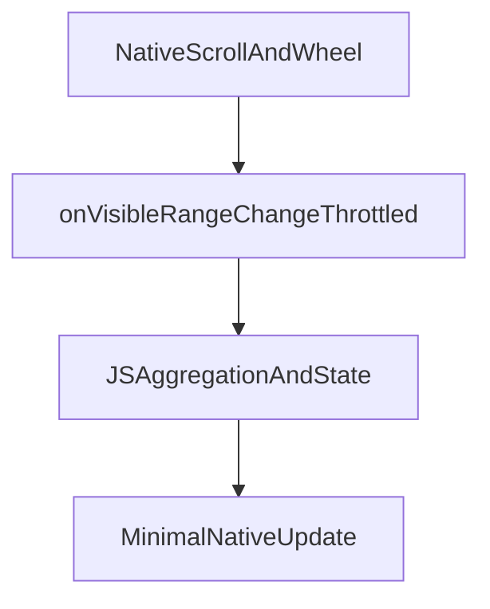

# Nitro Calendar Implementation Notes

## Goals

- Deliver a Gregorian-first calendar experience with native-grade smoothness.
- Add a time picker below the calendar that supports fast, precise wheel selection.
- Keep styling controlled by React Native props so app-level design systems stay consistent.
- Prepare for additional calendar systems later through a calendar-engine abstraction.

## Current Baseline

> **Status as of April 2026** — Phase 2 (calendar grid) and Phase 3 (wheel picker) are implemented natively on both iOS (SwiftUI via `UIHostingController`) and Android (Jetpack Compose via `ComposeView`). The `color` scaffold prop is replaced by the full `CalendarAppearance` / `CalendarStrings` / `WheelPickerAppearance` contract.

### What is implemented

**iOS (`ios/NitroCalendar.swift`, `ios/NitroWheelPickerView.swift`)**
- `HybridNitroCalendar` embeds a `UIHostingController<CalendarRootView>` inside `var view: UIView`.
- `CalendarViewModel` (`@ObservableObject`) bridges all Nitro prop setters to SwiftUI `@Published` state.
- Month grid: `TabView(.page)` with 20 001 virtual pages (midpoint = 10 000). `GeometryReader` sizes cells — no `UIScreen.main.bounds` reference.
- Mode transitions: `ZStack` + `.animation(.easeInOut(duration: 0.2), value: vm.mode)` with `.opacity.combined(with: .scale(0.97))` transitions.
- Collapse animation: `withAnimation(.easeInOut(duration: 0.25))` wrapping `vm.collapsedWeekMode.toggle()`.
- Month/year pickers: `LazyVGrid` 3×4.
- Collapse toggle button: centered below the grid, shows `strings.labelShowWeekView` / `strings.labelShowMonthView`.
- Header month/year label: derived from `pageIndex` offset from today, not from `selectedTimestampMs` — updates on swipe.
- Out-of-month day tap: navigates pager to that month via `vm.pageIndex`.
- `goToToday()`: resets `vm.pageIndex = 10_000`, emits `onDateChange`.
- `goToMonth()` / `goToYear()`: update `vm.pageIndex` to navigate pager to the correct month.
- Year picker chevrons: shift `vm.yearSliceStart ± 12` directly (not the day pager).
- `HybridNitroWheelPickerView` embeds `UIHostingController<WheelRootView>`.
- Standard wheel: `Picker(.wheel)` for non-loop, standard height.
- Loop/custom wheel: `ScrollView` + `scrollTargetBehavior(.viewAligned)` + `.scrollTransition` drum effect (iOS 17+).

**Android (`android/src/main/java/.../NitroCalendar.kt`, `NitroWheelPickerView.kt`)**
- `HybridNitroCalendar` uses `ComposeView` as `override val view: View`. No `RecyclerView`, no `GestureDetector`, no `lastDayGridLayoutSize` double-invalidation.
- `mutableStateOf` fields bridge Nitro prop setters to Compose state.
- Month grid: `HorizontalPager` (20 001 pages, midpoint = 10 000). `LazyVerticalGrid(GridCells.Fixed(7), fillMaxWidth)` — no hardcoded width.
- Mode transitions: `Crossfade(tween(200))`.
- Collapse animation: `animateContentSize(tween(250))` on the grid container.
- Month/year pickers: `LazyVerticalGrid` 3×4.
- Collapse toggle button: centered below the grid, shows `strings.labelShowWeekView` / `strings.labelShowMonthView`.
- Header month/year label: derived from `pagerState.currentPage` offset — updates on swipe.
- Pager sync: `LaunchedEffect(_pageIndex)` animates pager when `_pageIndex` is set externally (today, greyed-day tap, `goToMonth`, `goToYear`).
- Out-of-month day tap: computes month diff from today, sets `_pageIndex`.
- `goToToday()`: sets `_pageIndex = 10_000`, resets selected date.
- `goToMonth()` / `goToYear()`: update `_pageIndex` to navigate pager.
- Year picker: `LazyVerticalGrid` with `pointerInput(detectHorizontalDragGestures)` for swipe-to-change-slice.
- `HybridNitroWheelPickerView` uses `ComposeView`. No `RecyclerView`, no `scheduleApplyWheel()`, no `postDelayed(48ms)`.
- Wheel: `LazyColumn` + `rememberSnapFlingBehavior`. Spacer items at top/bottom so snap lands with selected item centered.
- Drum effect: `graphicsLayer` with `rotationX`, `scaleX/Y`, `alpha` based on distance from viewport center.
- `composeView.isNestedScrollingEnabled = false` prevents React Native `ScrollView` from stealing vertical touch events.
- `Modifier.nestedScroll(rememberNestedScrollInteropConnection())` on the wheel container for proper interop.

### Nitro bridge contract (unchanged — no Nitrogen regeneration needed)
- `HybridNitroCalendar: HybridNitroCalendarSpec` on both platforms.
- `HybridNitroWheelPickerView: HybridNitroWheelPickerViewSpec` on both platforms.
- All `abstract var` props and `abstract fun` methods from the generated specs are implemented.

### Known limitations / not yet implemented
- Non-Gregorian calendar types (`islamic`, `chinese`, etc.) — architecture supports them but only `gregorian` is wired.
- `uses24HourClock` prop is accepted but not yet used for display formatting.
- `localeId` is accepted but only used for `Calendar` locale on Android; iOS uses it for `cal.locale`.
- Time picker composition (calendar + wheel in one view) is not yet assembled — wheels work standalone.
- `onVisibleRangeChange` throttling is not yet implemented (fires on every page change).

## Legacy JS Context (Migration Source)

The folder `legacy-js-exemple` is the behavioral reference used for migration. It is **gitignored** and not part of the repository; keep a local copy only if you need side-by-side comparison during initial implementation.

Primary reference files (when present locally):

- `legacy-js-exemple/molecules/calendar-view-gregorian.tsx`
- `legacy-js-exemple/molecules/calendar-view.tsx`
- `legacy-js-exemple/organisms/calendar-time-picker.tsx`
- `legacy-js-exemple/services/calendar.ts`

Behavior extracted from legacy:

- Dots/markers on day cells from event aggregation output.
- Header modes (`days`, `months`, `years`) with interactive month/year labels.
- Month grid (12 months, 3x4), year slices (12 years, current year centered at index 6).
- RTL-aware **navigation** (what “previous” / “next” does through time); chevron assets stay visually consistent—no redundant icon swapping.
- Collapsible month-to-week mode using up/down chevrons.
- Date and time composition in one flow, with time picker displayed below calendar.

Migration intent:

- Preserve UX behavior and interaction semantics while moving heavy rendering/scrolling work to native.
- Keep JS as orchestration/data source layer, not per-frame animation/scroll driver.
- Improve memory pressure and UI CPU usage by reducing JS-driven view churn and payload size.

## Architecture Direction

The interaction model remains native-first:



Rules:

- Native handles scrolling, wheel inertia, snapping, and visual transitions.
- JS observes and updates data; JS does not drive per-frame motion.
- Bridge payloads should stay bounded to visible range plus a small buffer.

## Calendar engine specification

### Purpose

This is the official calendar implementation strategy for the Nitro calendar and datetime picker. It exists to keep iOS and Android consistent, keep interaction native-driven, support multiple calendar systems, and give a single rule set for implementation and codegen.

### Core principle

Calendar computation and interpretation of instants into calendar fields **must happen natively**, using each platform’s calendar APIs. **Do not** implement calendar math in JavaScript or share calendar logic across platforms via JS libraries.

There is no single cross-platform library that reliably matches full multi-calendar behavior on both platforms at UI performance. Therefore: **each platform uses its native calendar system; behavior is normalized behind one abstraction.**

### Platform implementations

| Platform | API | Reference |
|----------|-----|-----------|
| iOS | Foundation `Calendar`, `Date`, `DateComponents`, `DateFormatter` | Apple `Calendar(identifier:)` |
| Android | `android.icu.util.Calendar` + `android.icu.util.ULocale` | [ICU Calendar](https://developer.android.com/reference/android/icu/util/Calendar) |

**iOS (required utilities):** `Calendar.identifier`, `Calendar.dateComponents(_:from:)`, `Calendar.date(from:)`, `Date`.

**Android (required utilities):** `Calendar.getInstance(ULocale)`, `Calendar.setTimeInMillis(...)`, field getters, `ULocale` with `@calendar=` where needed.

**Android:** Prefer ICU for this module. **Do not** use `java.time` (or helpers like ThreeTenABP / `kotlinx-datetime`) as the source of truth for non-Gregorian calendar UI—ICU is the supported path for multi-calendar parity with iOS.

### Supported calendar kinds (target parity)

Both platforms should support the same logical set (concrete identifier / locale extension mapping lives in native code):

- gregorian
- islamic
- chinese
- indian
- japanese
- buddhist
- hebrew
- persian

Ship order can still be Gregorian-first; the abstraction must allow enabling the rest without changing JS calendar math.

### Shared abstraction: `CalendarType` (JS / Nitro)

String union passed from JS to select the active calendar system (exact Nitro spelling TBD when specs are added):

```ts
export type CalendarType =
  | 'gregorian'
  | 'islamic'
  | 'chinese'
  | 'indian'
  | 'japanese'
  | 'buddhist'
  | 'hebrew'
  | 'persian';
```

Native resolves `CalendarType` to a `Calendar` (iOS) or `android.icu.util.Calendar` (Android). Example direction (implementation detail, not final code):

**iOS:** `switch` on `CalendarType` → `Calendar(identifier: .gregorian | .islamic | …)`.

**Android:** `ULocale` with `@calendar=<type>` (or default valid locale) → `Calendar.getInstance(locale)`.

### Bridge data model (selection and instants)

**Primary rule:** For representing a selected instant, JS should pass **`timestamp` in milliseconds since Unix epoch** (same meaning as JS `Date.now()`). Native converts `timestamp` → calendar components in the active `CalendarType` (and display timezone rules defined by native contract).

**Avoid as the canonical selection payload:** ad hoc `{ year, month, day }` objects, preformatted date strings, or locale-dependent field bundles from JS as the source of truth—those belong on the native side after conversion.

Optional non-date props (still allowed): e.g. `calendarType`, `isRTL`, `timeZoneId` / policy for “floating” vs “zoned” display—these are configuration, not a duplicate calendar computation layer.

**Shared concept (documentation only):** logical day index can be thought of as derived from an instant + timezone rules; native owns the exact definition used for grid boundaries and tests.

### Consistency and testing (required direction)

Automated checks should verify, per `CalendarType`:

- Same `timestamp` → same visible civil date fields on iOS and Android (within the stated timezone policy).
- Month boundaries and leap behavior match platform expectations.
- Regression cases for known tricky calendar edges as they are discovered.

### Forbidden (explicit)

- **Android:** `java.time` as authority for non-Gregorian calendar grids; ThreeTenABP / `kotlinx-datetime` for that purpose.
- **iOS:** Hand-rolled calendar math or third-party calendar libraries as authority for civil fields.
- **JS:** Third-party calendar libraries for grid math or civil interpretation; repeated conversion of the same instants in tight loops.

### Performance (calendar-specific)

- Reuse calendar instances where possible; avoid allocating new `Calendar` / heavy formatters inside per-cell or per-scroll-tick work.
- Keep scroll and layout free of JS-side calendar conversion.

**Mental model:**

```text
JS: instants + configuration (timestamps, calendarType, appearance, strings, localeId, weekStartsOn, RTL)
Native: calendar system, conversion, grid + rendering
```

## Wheel Picker Engine (Implemented)

### Platform Strategy (actual implementation)

- **iOS**: `Picker(.wheel)` for standard use (non-loop, standard height). `ScrollView` + `scrollTargetBehavior(.viewAligned)` + `.scrollTransition` for loop/custom height (iOS 17+). No `UICollectionView` drum.
- **Android**: `LazyColumn` + `rememberSnapFlingBehavior` from `androidx.compose.foundation`. Spacer items at top/bottom so the selected item is always centered. `graphicsLayer` drum perspective (rotationX, scale, alpha) replaces `applyWheelPerspectiveToVisible()`. No `RecyclerView`, no `LinearSnapHelper`, no `postDelayed` chains.

### Scroll interop with React Native ScrollView

When the wheel is inside a React Native `ScrollView`, set `composeView.isNestedScrollingEnabled = false` on Android so the `LazyColumn` receives vertical touch events before the parent. On iOS, `UIHostingController` handles this automatically.

### Shared Wheel Behavior Contract (implemented)

- Center item is selected — spacer items ensure snap always lands with selected item at viewport center.
- Partial items visible above/below center with drum opacity/scale/tilt effect.
- Snap to closest item at rest via `rememberSnapFlingBehavior` (Android) / `scrollTargetBehavior(.viewAligned)` (iOS).
- Optional infinite looping via virtual item count (`values.size * 1000`, midpoint centering).
- `onSettled` fires once per scroll stop via `snapshotFlow { isScrollInProgress }.filter { !it }` (Android) / `DragGesture.onEnded` (iOS standard) / scroll stop detection (iOS loop).
- `onValueChange` fires only on index change during scroll.

## Calendar + Time Picker Composition

Planned display composition:

- `CalendarView` section (top).
- `TimePickerView` section (below).
- Both arranged in a plain vertical container.

This keeps integration simple while allowing independent native optimization for each block.

## Calendar Header and Navigation UX

Default calendar header behavior:

- Layout: `<   month year   [today]   >`
- Left and right chevrons move through calendar pages (placement follows `I18nManager` mirroring; **actions** for prev/next are wired for RTL without redundant icon swapping—see [RTL and Icon Mapping Contract](#rtl-and-icon-mapping-contract)).
- Month label is a button; year label is a button; `today` is a button.

### Month selection mode

- Clicking month switches day-grid view to a month-grid view.
- Month-grid has 12 months shown as 3 columns x 4 rows in natural order.
- Selecting a month jumps directly to that month and returns to day-grid view.
- No chevrons are required in this mode for Gregorian (single set of 12).

### Year selection mode

- Clicking year switches day-grid view to a year-grid view.
- Year-grid shows 12 years per page.
- Current year should appear at slot 7 (index 6) in the initial page.
- Year-grid includes chevrons to move by 12-year slices for consistency.
- Selecting a year jumps directly to that year and returns to day-grid view.

### Back behavior in picker modes

- In month/year picker modes, `today` is replaced by a `back` action.
- `back` returns to normal day-grid mode without changing selection state unexpectedly.

### Collapsible month-to-week mode

- Calendar supports collapsing from month view into week-only view.
- Collapse/expand control uses up/down chevrons and is part of the required baseline UX.
- This mode must preserve the selected date and focused week when toggling.

## Styling, typography, and localization contract

Native views must **not** depend on Tamagui, i18next, or other JS-only stacks. Instead, the host app maps its theme and translations into **explicit Nitro props** so calendars and wheels look and read like the rest of the app.

### Appearance (`CalendarAppearance` / `WheelPickerAppearance`)

- Structured tokens: header, weekday row, day grid, month/year picker cells, shell colors, typography (family, sizes, weights), layout (cell size, row height, spacing), shape (radius, borders).
- **`markerPalette`**: ordered list of dot colors (hex or resolved tokens). Per-day marker updates pass **integer indices** into this array only — see Phase 1 / Phase 4 — not repeated color strings on every range change.
- The placeholder `color` prop on the current scaffold is **not** the final model; see [phase-1-contracts-specs.md](./phase-1-contracts-specs.md) §1.4.

### Strings (`CalendarStrings`)

- **All visible labels** (month names, weekday abbreviations, “today”, “back”, week/month toggle copy, optional a11y hints) are passed as **already-resolved strings** from the app’s i18n layer.
- Native does **not** call JS for copy during interaction; this keeps scrolling smooth and guarantees the same translations as the host.
- Arrays are **fixed size** and ordered consistently with `weekStartsOn` (weekdays) and calendar rules (months). Non-Gregorian `calendarType` may use different conventions when enabled; document per engine in Phase 5.

### Memoization and updates

- Host apps should `useMemo` (or equivalent) `appearance` and `strings` keyed on theme, locale, `calendarType`, and `weekStartsOn`. When only selection changes, avoid recreating those objects.
- If generated bindings cannot deep-compare nested props, use optional **`stringsKey` / `appearanceKey`** (or a single `configRevision`) so native knows to refresh.

### Optional `localeId`

- BCP 47 tag for **fallback formatting** when a string is omitted or for future native-only labels; primary UX copy should still come from `strings` for app parity.

### Wheel picker

- Row values remain `string[]` from JS; optional `WheelPickerAppearance` aligns fonts and colors with `CalendarAppearance`.

Guideline:

- Do not reimplement Tamagui (or any JS design system) in native—**map tokens once in JS** into the Nitro contract.

## RTL and Icon Mapping Contract

Direction affects **navigation behavior** (how the user moves through weeks/months/years and what swipe direction does), **not** a requirement to mirror or swap chevron assets for appearance.

- The app uses React Native **`I18nManager`** for RTL. Prefer **one** source of truth: either layout mirroring from RN/native UI direction **or** explicit direction flags—**do not** stack the same reversal twice (e.g. mirroring the whole header and also manually swapping left/right icons and handlers).
- When a Nitro view needs explicit direction, JS may still pass `isRTL` (or read equivalent from native context). Use it to wire **prev/next actions** and swipe polarity correctly, not to “flip” icons for decoration.
- **Icons:** Keep the baseline glyph mapping stable. Visually, left/right chevrons normally stay as-is; what reverses in RTL is **which action** is triggered from a given gesture or edge, consistent with reading direction and platform expectations.
- Vertical arrows (`up`/`down`) keep their meaning in both directions.

Baseline icon map (platform-native glyph names):

- `chevron-right`: iOS `chevron.right`, Android `chevron_right`
- `chevron-left`: iOS `chevron.left`, Android `chevron_left`
- `chevron-up`: iOS `chevron.up`, Android `expand_less`
- `chevron-down`: iOS `chevron.down`, Android `expand_more`

Notes:

- Keep icon key names stable in JS so theme/override systems can target them.
- Allow optional advanced icon override props for custom icon packs later.
- Some non-Gregorian calendar engines may need additional navigation icons; design contract should permit calendar-specific overrides.

## Data and Event Contracts (Draft)

Calendar draft props/events:

- `selectedTimestampMs` (or `initialTimestampMs`) — primary instant; see [Calendar engine specification](#calendar-engine-specification)
- `timeZoneId` (optional) — display/boundary policy when not using device default only
- `localeId` (optional) — BCP 47; formatting fallback; see styling/localization contract above
- `weekStartsOn` (optional) — aligns weekday column order with app locale
- `appearance` — `CalendarAppearance` (full theme tokens)
- `strings` — `CalendarStrings` (resolved i18n copy; memoize in host)
- `isRTL`
- `calendarType` — see `CalendarType` union in calendar engine section (Gregorian first for shipping)
- `minTimestampMs` / `maxTimestampMs` (optional) — inclusive selectable **date** bounds; same instant type as selection; required for parity with date-time picker range UX
- `onDateChange`
- `onVisibleRangeChange`
- `onViewModeChange` (month, week, monthPicker, yearPicker)
- marker update API: **`appearance.markerPalette`** + **`DayMarkerCompact`** (`timestampMs` + `dotIndices[]`) for visible-range batches — avoid repeating hex strings per cell on every update

Calendar draft methods:

- `goToToday()`
- `goToMonth(monthIndex: number)`
- `goToYear(year: number)`
- `setCollapsedWeekMode(enabled: boolean)`

Time draft props/events:

- `hour`, `minute`, optional `period` (AM/PM)
- 24h and 12h modes
- `minTimestampMs` / `maxTimestampMs` (optional) — together with the **calendar-selected day**, native clamps hour/minute so invalid times are not selectable (logic stays in native; see Phase 1 §1.8 / Phase 3)
- `selectedDayTimestampMs` (or equivalent) — identifies the day the user picked on the calendar for time clamping
- `onTimeChange` — **coalesced**: emit after wheels **settle**, not on every scroll tick (align with `onSettled` per wheel; JS does not debounce a flood of bridge events)

All signatures are provisional until Nitro specs are implemented.

## Performance Guardrails

- Throttle visible-range callbacks.
- Buffer one adjacent range segment for preloading.
- Skip native updates if payload is unchanged.
- Keep marker payload limited to visible + buffer; use **palette indices** (`number[]` per day), not per-dot color strings on the hot path.
- Debounce heavy JS reactions to rapid time change events.
- Prefer settle-time callbacks for expensive JS side effects.
- Date-time wheels: **`onTimeChange` / composed datetime** should reflect **settled** wheel positions only; range clamping uses `minTimestampMs` / `maxTimestampMs` + selected day **inside native**.

## Future Optimizations

- Month-level cache for marker results.
- Direction-aware precompute/prefetch.
- Partial marker updates (`mergeDots`) instead of full map replacement.

## Migration Phases

**Progress tracking:** Use [phases.md](./phases.md) as the lightweight checklist; this section stays the technical breakdown.

1. **API and contracts** ✅ Done
   - Nitro specs defined for calendar and wheel views (props, methods, events).
   - RTL semantics, icon mapping, and directionality contracts locked.

2. **Native skeleton and parity harness** ✅ Done
   - Swift/Kotlin host view skeletons built.
   - Example app (`example/src/App.tsx`) provides side-by-side test screen.

3. **Feature parity migration** ✅ Done (Gregorian)
   - Day/month/year modes, range navigation, collapse-to-week behavior implemented.
   - Wheel engine with snap, loop, drum perspective implemented on both platforms.
   - Marker/dot updates wired with `DayMarkerCompact` (palette index approach).
   - SwiftUI (`UIHostingController`) on iOS, Jetpack Compose (`ComposeView`) on Android.
   - All legacy UIKit/RecyclerView code removed.

4. **Performance hardening** 🔄 In progress
   - Update dedupe: `mutableStateOf` / `@Published` only triggers recompose on actual change.
   - `onVisibleRangeChange` throttling not yet implemented.
   - Memory/CPU profiling under fast fling not yet benchmarked.

## Contributor Reading Order

- `src/NitroCalendar.nitro.ts`
- `src/index.tsx`
- `ios/NitroCalendar.swift`
- `android/src/main/java/com/margelo/nitro/novasteraoss/nitrocalendar/NitroCalendar.kt`
- `CONTRIBUTING.md`

